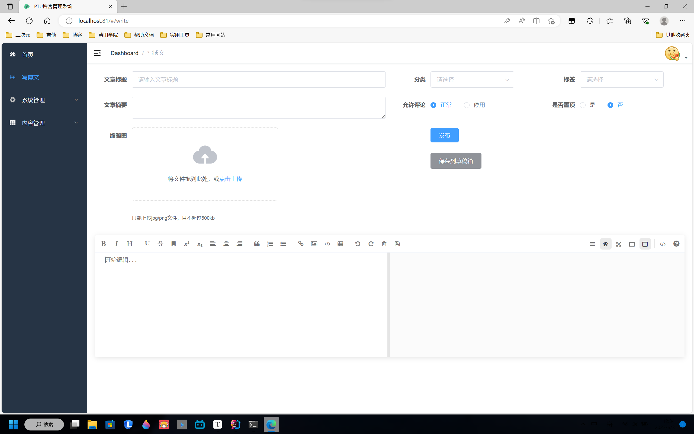

# ptu-blog

#### 介绍

课程设计，一个简单的博客系统

#### 软件架构

- 后端：springboot
- 前端：Vue
- 数据库：mysql
- ORM：mybatisPlus
- 缓存：redis
- 权限认证：springSecurity+jwt


#### 页面展示

**登录密码：1234**

- 前台


- 后台





#### 安装教程

##### windows系统

- 1.使用git克隆项目或者下载压缩包

```bash
git clone https://gitee.com/aaabanana/ptu-blog.git
```

- 2.创建数据库blog并运行项目目录下/document/sql的sql文件

```sql
CREATE DATABASE blog character set utf8;
```

- 3.（启动blog后端）在项目目录/blog/src/main/resources/下，修改application.yml文件中的数据库密码和文件保存路径和端口号。加载完maven配置后，先运行redis，再在项目目录/blog/src/main/java/com/my/blog下，运行BlogApplication.java

- 4.（启动admin后端）在项目目录admin/src/main/resources/下，修改application.yml文件中的数据库密码和文件保存路径。加载完maven配置后，先运行redis，再在项目目录admin/src/main/java/com/my/blog下，运行AdminApplication.java

- 5.进入项目目录/ptu-blog-vue，或者/ptu-admin-vue输入以下命令，即可启动前端

```bash
npm install # 下载前端的依赖
npm run dev # 运行
```

##### linux系统

（后端）自行配置redis的地址，主机域名，端口，数据库地址，打包完使用Java -jar命令运行。

（前端）略


#### 参与贡献

1.  Fork 本仓库
2.  新建 Feat_xxx 分支
3.  提交代码
4.  新建 Pull Request
